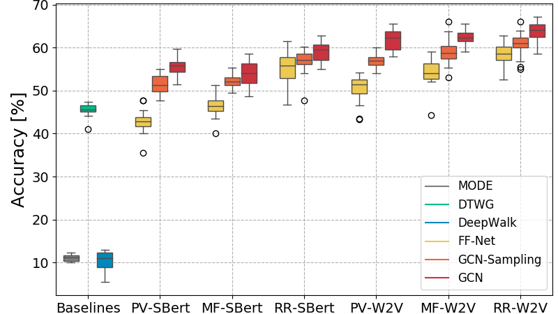

# RETRO: Relation Retrofitting For In-Database Machine Learning on Textual Data
RETRO is a framework that provides tools to automatically extract text values from a PostgreSQL database, represent those text values by a continuous vector representation using a word embedding model.
In order to incorporate semantic knowledge from the database into the representation, it extracts additional relational information from the database and uses this knowledge to refine the embeddings by a relational retrofitting method.
The resulting embeddings can then be used to perform machine learning tasks.

For more details about the algorithm, take a look at the [paper](https://dl.acm.org/doi/10.1145/3340531.3412056).

## Setup

In order to connect to a PostgreSQL database, you have to configure the database connection in the `config/db_config.json`.
In order to run RETRO you might need to install some python packages (e.g. numpy, psycopg2, networkx, scipy, sklearn).

### Import Word Embedding Model
RETRO is independent of the word embedding model you want to use for the text values.
If you want to use the popular Google News word embedding model, you can download it and import it to the database as follows (requires the [gensim](https://radimrehurek.com/gensim/) python package):
```
mkdir vectors
wget -c "https://s3.amazonaws.com/dl4j-distribution/GoogleNews-vectors-negative300.bin.gz" -P vectors
gzip --decompress vectors/GoogleNews-vectors-negative300.bin.gz
python3 core/transform_vecs.py
python3 core/vec2database.py config/google_vecs.config config/db_config.json
```

### Execute RETRO

In order to execute RETRO, you might reconfigure `config/retro_config.json`.
For example, in the `TABLE_BLACKLIST` property, you can define tables that should be ignored by the retrofitting.
You can start the retrofitting by executing the following commands:
```
mkdir output
python3 core/run_retrofitting.py config/retro_config.json config/db_config.json
```
After the script is passed through, you can find the results in the table `retro_vecs` in the PostgreSQL database and the file `output/retrofitted_vectors.wv`.

## Example ML Task

As one example of a machine learning task, you can run a category imputation task on a dataset of [Google Play Store Apps](https://www.kaggle.com/lava18/google-play-store-apps).

### Create the Database

The script provided in [google-play-dataset-import](https://github.com/guenthermi/google-play-dataset-import) can be used to create a database containing the data from the App Store dataset.
In order to set up the database, clone the repository and follow the instruction in the README file.

### Configuration

The configuration files `ml/retro_config.json`, `ml/db_config.json` and `ml/db_config.json` have to be adapted to your database.
By using the default configuration in `ml/retro_config.json` the category and genre property are ignored since those are the properties we want to predict with our classifier (often the genre property equals the category).

### Retrofitting

First, relational retrofitting has to be executed on the database.
Given a word embedding model is imported to the database as described above, retrofitting can be executed as follows:

```
mkdir output
python3 core/run_retrofitting.py ml/retro_config.json ml/db_config.json
```

### Classification with Feed-Forward Network

After executing the retrofitting, the classification can be started.
The category imputation task can be performed with `ml/multi_class_prediction.py`:

```
python3 ml/multi_class_prediction.py ml/db_config.json ml/classify_app_categories_config.json
```

After running and evaluating the classification, this should output a results file and a box-plot diagram in the output folder defined in `ml/classify_app_categories_config.json` (default: `output/`).

### Classification with Graph Neural Network

Alternatively, a classification can be performed with graph neural networks by using `ml/gnn/gnn_imputation.py` or `ml/gnn/gnn_imputation_fast.py`.
Both scripts require the following arguments:
* *retro_config*: configuration file of the previously executed retrofitting process
* *query*: a query to read out the data for the classification from the database
* *train_size*: number of training samples
* *test_size*: number of test samples
* *iterations*: number of evaluation iterations
* *retro_table*: name of the table with the retrofitted vectors

The script `ml/gnn/gnn_imputation_fast.py` employs neighbor sampling to sped up the GNN model.
The evaluation of the models on the app database can be executed as follows:
```
python3 ml/gnn/gnn_imputation.py config/retro_config.json config/db_config.json "SELECT r.id, r.word, a.category_id, r.vector FROM apps AS a INNER JOIN {vec_table} AS r ON r.word = concat('apps.name#', regexp_replace(a.name, '[\\.#~\\s\\xa0,\\(\\)/\\[\\]:]+', '_', 'g'))" 400 400 3 retro_vecs
```

Here are some results of the evaluation on common word embedding datasets (details can be found in the [publication](https://dl.acm.org/doi/10.1145/3340531.3412056)):



## References
[Learning from Textual Data in Database Systems](https://dl.acm.org/doi/10.1145/3340531.3412056)
